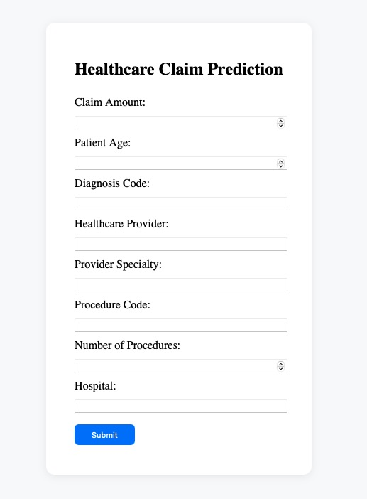

# Healthcare Claims Data Analysis App

## Goal
I built an AI-powered app predicting healthcare claim approval using a Flask backend, HTML/JavaScript frontend, and machine learning models for real-time inference.

## Workflow
Users submit claim data through a web form, which sends the data to a Python Flask backend that preprocesses the input and uses machine learning models to predict the likelihood of claim approval.
The prediction result is then displayed to the user on the frontend.

1. User enters healthcare claim data into the web form on the frontend.

2. Frontend sends the claim data as a POST request to the Flask backend API.

3. Backend preprocesses the input data to match the model’s requirements.

4. Backend loads the trained ML model and predicts the approval likelihood and returns the prediction result to the frontend.

5. The frontend displays the approval likelihood to the user.

